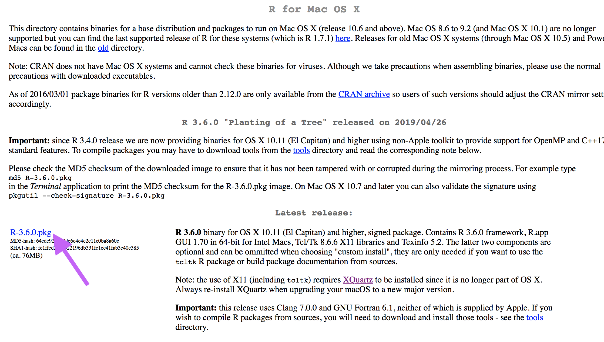
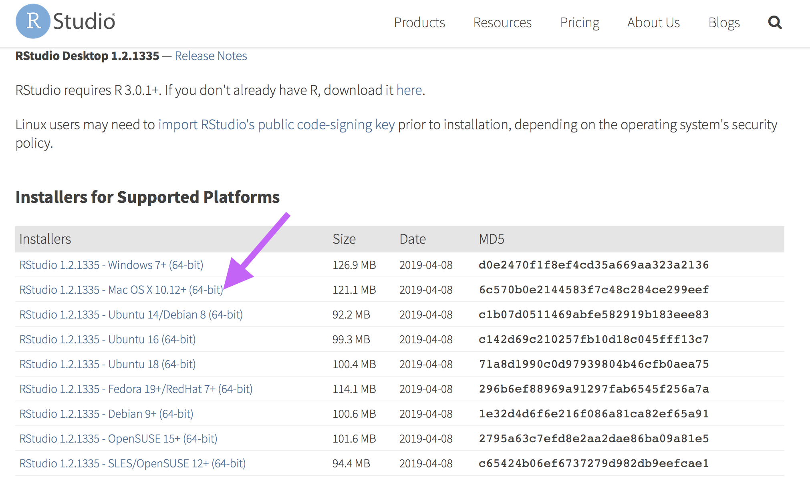

Intro to Data Wrangling
================
Dr. Melissa Crow, Fanny Chow
4/28/2019

-   [Setup](#setup)
    -   [Download R](#download-r)
    -   [Download RStudio](#download-rstudio)
    -   [Download Files](#download-files)
-   [Introduction](#introduction)
    -   [Setup: Installing packages](#setup-installing-packages)
    -   [Setup: Loading packages](#setup-loading-packages)
    -   [Inputting data](#inputting-data)
    -   [Viewing data](#viewing-data)
    -   [Choosing variables: select()](#choosing-variables-select)
    -   [Focusing on certain cases: filter()](#focusing-on-certain-cases-filter)
    -   [Creating new variables: mutate()](#creating-new-variables-mutate)
    -   [Sorting your data: arrange()](#sorting-your-data-arrange)
    -   [Grouped summaries: group\_by() and summarize()](#grouped-summaries-group_by-and-summarize)
    -   [Workflow: piping %&gt;%](#workflow-piping)
    -   [Conclusion](#conclusion)
    -   [Your turn](#your-turn)

Setup
-----

### Download R

Download R (free software environment for statistical computing & graphics)
<https://cran.cnr.berkeley.edu>



### Download RStudio

RStudio Desktop is a powerful user interface for R.

<https://www.rstudio.com/products/rstudio/download/#download> 

In your `Downloads` folder, click on the RStudio .dmg you just downloaded. Then double-click the RStudio icon.

### Download Files

In the "Console" below, type:

``` r
install.packages("usethis")
library(usethis)
use_course("https://bit.ly/2DEdbkG")
```

The command should copy to to your Desktop and ask you if you prefer a different location. Type `destdir` to have the lesson downloaded onto your desktop directory. Then type the number that corresponds to "Yup" or "Yes." You can choose to delete the ZIP file by typing the number for "Yup." Now you should have the intro-data-wranling project opened up!

Introduction
============

Data is everywhere! And making sense of data is a great skill to help us make sense of the world around us.

Your phone counts how many steps you take and shows you your physical activity patterns. Netflix collects your viewing behaviors as datapoints and recommends you new movies to watch based on similar users.

But before you can try to make sense of data, you have to confront the reality that data, like life, is messy. A recent NY Times article claimed that 50-80% of a data analysis project can be spent just getting your data into a format you can use-- sorting it, simplifying it, cleaning it up, creating variables, changing the format, etc. That's why we're here to practice today!


Fortunately, this process of **data wrangling** is much easier with R. In particular, today we will learn about several common commands for data management:

-   `select`: selects only certain columns in your data set
-   `filter`: selects only certain cases in your data, based on criteria you choose
-   `mutate`: lets you create a new variable
-   `arrange`: sorts your data set by a particular variable

You can find this document online at (<https://github.com/fbchow/intro-data-wrangling/blob/master/Data_Wrangling.md>).

A useful resource for this is the RStudio Data Wrangling cheatsheet, which you can find online at (<https://www.rstudio.com/wp-content/uploads/2015/02/data-wrangling-cheatsheet.pdf>).

You may also find the examples in Chapter 3 of [Exploratory Data Analysis with R](https://bookdown.org/rdpeng/exdata/) helpful.

#### Setup: Installing packages

Let's start by installing some very useful packages. In your console, type:

``` r
install.packages("tidyverse")
```

#### Setup: Loading packages

Now that we've installed the packages we need, we have to load them into R. This tells R that we want to use those packages for our current project.

Start by creating a new script in RStudio. Then type the following code and run it:

``` r
library(tidyverse)
```

Great! We are ready to get started. Let's get some data.

#### Inputting data

We talked about two ways to input data last time:

-   Creating a variable using `<-`
-   Inputting an entire data set using `read.csv()`

Let's read in some data from a website.

**Example:** Getting data from the internet

Which country is the happiest country in each region of hte world? Which has the longest life expectancy or the highest GDP?

Let's try answering these questions using the HappyPlanetIndex data set.

``` r
happy_planet <- read_csv("http://www.lock5stat.com/datasets/HappyPlanetIndex.csv")
```

    ## Parsed with column specification:
    ## cols(
    ##   Country = col_character(),
    ##   Region = col_double(),
    ##   Happiness = col_double(),
    ##   LifeExpectancy = col_double(),
    ##   Footprint = col_double(),
    ##   HLY = col_double(),
    ##   HPI = col_double(),
    ##   HPIRank = col_double(),
    ##   GDPperCapita = col_double(),
    ##   HDI = col_double(),
    ##   Population = col_double()
    ## )

What does this data look like? Can we use this data to answer the questions above?

#### Viewing data

In the past, we simply typed the name of our data set or variable in order to get R to print it out. But this can sometimes backfire. What happens if we try to print out our entire data set `happy_planet`?

``` r
happy_planet
```

The `happy_planet` data contains data on 143 countries with 11 variables-- we really don't want that cluttering up our computer.

There are several ways to deal with this. First, we could just print out the first few rows:

``` r
head(happy_planet)
```

    ## # A tibble: 6 x 11
    ##   Country Region Happiness LifeExpectancy Footprint   HLY   HPI HPIRank
    ##   <chr>    <dbl>     <dbl>          <dbl>     <dbl> <dbl> <dbl>   <dbl>
    ## 1 Albania      7       5.5           76.2       2.2  41.7  47.9      54
    ## 2 Algeria      3       5.6           71.7       1.7  40.1  51.2      40
    ## 3 Angola       4       4.3           41.7       0.9  17.8  26.8     130
    ## 4 Argent…      1       7.1           74.8       2.5  53.4  59.0      15
    ## 5 Armenia      7       5             71.7       1.4  36.1  48.3      48
    ## 6 Austra…      2       7.9           80.9       7.8  63.7  36.6     102
    ## # … with 3 more variables: GDPperCapita <dbl>, HDI <dbl>, Population <dbl>

But that's still quite messy because we have 11 variables.

One thing I like to do is use the `View()` command to open up a new tab showing a spreadsheet of my data.

``` r
View(happy_planet)
```

We can learn more about the structure of the data:

``` r
str(happy_planet)
```

    ## Classes 'spec_tbl_df', 'tbl_df', 'tbl' and 'data.frame': 143 obs. of  11 variables:
    ##  $ Country       : chr  "Albania" "Algeria" "Angola" "Argentina" ...
    ##  $ Region        : num  7 3 4 1 7 2 2 7 5 7 ...
    ##  $ Happiness     : num  5.5 5.6 4.3 7.1 5 7.9 7.8 5.3 5.3 5.8 ...
    ##  $ LifeExpectancy: num  76.2 71.7 41.7 74.8 71.7 80.9 79.4 67.1 63.1 68.7 ...
    ##  $ Footprint     : num  2.2 1.7 0.9 2.5 1.4 7.8 5 2.2 0.6 3.9 ...
    ##  $ HLY           : num  41.7 40.1 17.8 53.4 36.1 63.7 61.9 35.4 33.1 40.1 ...
    ##  $ HPI           : num  47.9 51.2 26.8 59 48.3 ...
    ##  $ HPIRank       : num  54 40 130 15 48 102 57 85 31 104 ...
    ##  $ GDPperCapita  : num  5316 7062 2335 14280 4945 ...
    ##  $ HDI           : num  0.801 0.733 0.446 0.869 0.775 0.962 0.948 0.746 0.547 0.804 ...
    ##  $ Population    : num  3.15 32.85 16.1 38.75 3.02 ...
    ##  - attr(*, "spec")=
    ##   .. cols(
    ##   ..   Country = col_character(),
    ##   ..   Region = col_double(),
    ##   ..   Happiness = col_double(),
    ##   ..   LifeExpectancy = col_double(),
    ##   ..   Footprint = col_double(),
    ##   ..   HLY = col_double(),
    ##   ..   HPI = col_double(),
    ##   ..   HPIRank = col_double(),
    ##   ..   GDPperCapita = col_double(),
    ##   ..   HDI = col_double(),
    ##   ..   Population = col_double()
    ##   .. )

If we have questions about it in more detail, we can view the data documentation at (<http://happyplanetindex.org/about#how>).

It turns out the data set has 11 variables:

-   **Region:** 1=Latin America, 2=Western nations, 3=Middle East, 4=Sub-Saharan Africa, 5=South Asia, 6=East Asia, 7=former Communist countries
-   **Happiness** Scored on a 0-10 scale for average level of happiness (10 is happiest)
-   **LifeExpectancy** Average life expectancy (in years)
-   **Footprint** Ecological footprint - a measure of the (per capita) ecological impact
-   **HLY** Happy Life Years - combines life expectancy with well-being
-   **HPI** Happy Planet Index (0-100 scale)
-   **HPIRank** HPI rank for the country
-   **GDPperCapita** Gross Domestic Product (per capita)
-   **HDI** Human Development Index
-   **Population** Population (in millions)

Choosing variables: select()
----------------------------

Suppose we are most interested in comparing the happiness of a country with its GDP. All the other variables can just make our data confusing to look at.

We can focus on a few variables using `select()`.

``` r
happy <- happy_planet %>%
  select(Country, Region, Happiness, GDPperCapita, Population)


happy_small <- happy_planet %>%
  select(Country, Region, Happiness)
head(happy_small)
```

    ## # A tibble: 6 x 3
    ##   Country   Region Happiness
    ##   <chr>      <dbl>     <dbl>
    ## 1 Albania        7       5.5
    ## 2 Algeria        3       5.6
    ## 3 Angola         4       4.3
    ## 4 Argentina      1       7.1
    ## 5 Armenia        7       5  
    ## 6 Australia      2       7.9

Focusing on certain cases: filter()
-----------------------------------

Suppose we want to focus on the link between Happiness and GDPperCapita in Western nations. If we check the data documentation, we see that this is region 2. How can we just look at the countries in region 2?

``` r
happy2 <- happy_small %>%
  filter(Region == 2)

head(happy2)
```

    ## # A tibble: 6 x 3
    ##   Country   Region Happiness
    ##   <chr>      <dbl>     <dbl>
    ## 1 Australia      2       7.9
    ## 2 Austria        2       7.8
    ## 3 Belgium        2       7.6
    ## 4 Canada         2       8  
    ## 5 Cyprus         2       7.2
    ## 6 Denmark        2       8.1

Note that we had to use `==` instead of just `=`. This is because `=` would set the entire variable region equal to 2 instead of just checking to see which countries were in region 2.

We can use filter to choose any kind of subset in our data. For instance, we could look at the happiest countries:

``` r
happy2 %>%
  filter(Happiness > 7)
```

    ## # A tibble: 21 x 3
    ##    Country   Region Happiness
    ##    <chr>      <dbl>     <dbl>
    ##  1 Australia      2       7.9
    ##  2 Austria        2       7.8
    ##  3 Belgium        2       7.6
    ##  4 Canada         2       8  
    ##  5 Cyprus         2       7.2
    ##  6 Denmark        2       8.1
    ##  7 Finland        2       8  
    ##  8 France         2       7.1
    ##  9 Germany        2       7.2
    ## 10 Iceland        2       7.8
    ## # … with 11 more rows

You can also use filter to find specific cases in a large data set:

``` r
happy2 %>%
  filter( Country %in% c("Australia", "Canada", "United States of America"))
```

    ## # A tibble: 3 x 3
    ##   Country                  Region Happiness
    ##   <chr>                     <dbl>     <dbl>
    ## 1 Australia                     2       7.9
    ## 2 Canada                        2       8  
    ## 3 United States of America      2       7.9

Creating new variables: mutate()
--------------------------------

What if we want to find the overall Gross Domestic Product (GDP) of each country? The data set gives us GDP per person, but not the overall GDP of each country.

Fortunately, the data set also gives us the population (in millions). We can use this to calculate the total GDP for each country. Then we can save that calculation in a variable called TotalGDP in case we want to use it later.

``` r
happy3 <- happy %>%
  mutate(TotalGDP = GDPperCapita * Population )

head(happy3)
```

    ## # A tibble: 6 x 6
    ##   Country   Region Happiness GDPperCapita Population TotalGDP
    ##   <chr>      <dbl>     <dbl>        <dbl>      <dbl>    <dbl>
    ## 1 Albania        7       5.5         5316       3.15   16745.
    ## 2 Algeria        3       5.6         7062      32.8   231987.
    ## 3 Angola         4       4.3         2335      16.1    37594.
    ## 4 Argentina      1       7.1        14280      38.8   553350 
    ## 5 Armenia        7       5           4945       3.02   14934.
    ## 6 Australia      2       7.9        31794      20.4   648598.

This gives us the total GDP for each country in millions of dollars.

Sorting your data: arrange()
----------------------------

So now we have the happiness scores and total GDP for all the countries in the data set. Which countries are the happiest? The wealthiest?

We could go through our data by hand and try to find the largest values, but that sounds like a pain. Let's sort our data to find out.

The happiest countries:

``` r
happy4 <- happy3 %>%
  arrange( desc(Happiness))

head(happy4)
```

    ## # A tibble: 6 x 6
    ##   Country    Region Happiness GDPperCapita Population TotalGDP
    ##   <chr>       <dbl>     <dbl>        <dbl>      <dbl>    <dbl>
    ## 1 Costa Rica      1       8.5        10180       4.33   44079.
    ## 2 Denmark         2       8.1        33973       5.42  184134.
    ## 3 Ireland         2       8.1        38505       4.16  160181.
    ## 4 Norway          2       8.1        41420       4.62  191360.
    ## 5 Canada          2       8          33375      32.3  1078346.
    ## 6 Finland         2       8          32153       5.25  168803.

``` r
happy5 <- happy3 %>%
  arrange( desc(TotalGDP)) %>%
  select(Country, TotalGDP, Happiness)

head(happy5)
```

    ## # A tibble: 6 x 3
    ##   Country                   TotalGDP Happiness
    ##   <chr>                        <dbl>     <dbl>
    ## 1 United States of America 12420804.       7.9
    ## 2 China                     8814506.       6.7
    ## 3 Japan                     3994985.       6.8
    ## 4 India                     3778490.       5.5
    ## 5 Germany                   2429649.       7.2
    ## 6 United Kingdom            2001925.       7.4

Grouped summaries: group\_by() and summarize()
----------------------------------------------

In the last section, we built on the skills we had already developed in order to find the happiest countries in one particular region. But what if we wanted to compare happiness across all the regions, on average?

We can do this by creating a grouped summary. First we group our data by one variable (e.g. Region), and then we summarize each region (e.g. with the average happiness in that region).

Here's what the code looks like:

``` r
happy_planet %>%
  group_by(Region) %>%
  summarize(AverageHappy = mean(Happiness))
```

    ## # A tibble: 7 x 2
    ##   Region AverageHappy
    ##    <dbl>        <dbl>
    ## 1      1         6.91
    ## 2      2         7.55
    ## 3      3         5.99
    ## 4      4         4.05
    ## 5      5         5.59
    ## 6      6         6.32
    ## 7      7         5.74

Workflow: piping %&gt;%
-----------------------

Suppose we want to do multiple tasks at once. It got a little clunky to try to keep creating multiple data sets-- happy2, happy3, happy4, etc.

What if we could put everything in order and have R go through all the steps at once?

We can.

For instance, if we wanted to focus on Western countries and look at the total GDP of the happiest countries, we could do so:

``` r
happy_final <- happy_planet %>%
  filter(Region == 2) %>%
  mutate(TotalGDP = GDPperCapita * Population ) %>%
  arrange( desc(Happiness)) %>%
  select(Country, TotalGDP, Happiness)

head(happy_final)
```

    ## # A tibble: 6 x 3
    ##   Country   TotalGDP Happiness
    ##   <chr>        <dbl>     <dbl>
    ## 1 Denmark    184134.       8.1
    ## 2 Ireland    160181.       8.1
    ## 3 Norway     191360.       8.1
    ## 4 Canada    1078346.       8  
    ## 5 Finland    168803.       8  
    ## 6 Australia  648598.       7.9

Conclusion
----------

Getting your data set up in R can be challenging, but there are a few functions that help make things tidier.

-   View: view your data in a separate tab
-   select: choose variables
-   filter: choose cases
-   mutate: create new variables
-   group\_by and summarize: create grouped summaries
-   %&gt;%: speed up your workflow

Your turn
---------

1.  Input the data set "HomesForSale" from the Lock5 website (<http://www.lock5stat.com/datasets/HomesForSale.csv>).

2.  Filter your data to only look at homes with fewer than 5 bedrooms.

3.  Create a new variable to measure the price-to-size ratio. In other words, let PricePerArea = Price / Size.

4.  Use a grouped summary to find the average price per square foot in each of the four states. Which state has the most expensive houses per square foot?
